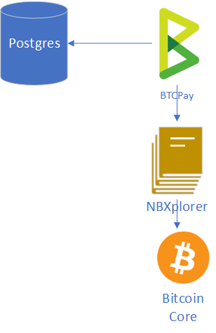

# Architecture

BTCPayServer is a project which ties together several Bitcoin-related components into a coherent user experience for installing and managing your own payment processor.

The minimal setup involves:

* [BTCPayServer](https://github.com/btcpayserver/btcpayserver)
* [NBXplorer](https://github.com/dgarage/NBXplorer) \(Lightweight block explorer, responsible for tracking payments\)
* Bitcoin Core
* \(Optional\) PostgreSQL

By default, it uses SqlLite, but all production deployments use Postgres.

Additionally, if you need Lightning Network access, NBXplorer supports connections to:

* C-Lightning \(via unix sockets\)
* Lightning Charge
* LND \(via the REST interface\)

We provide several ways of deploying BTCPayServer, depending on whether you favor flexibility or ease-of-use.

From the easiest way to the hardest:

* [Web-Interface LunaNode deployment](https://medium.com/@BtcpayServer/launch-btcpay-server-via-web-interface-and-deploy-full-bitcoin-node-lnd-in-less-than-a-minute-dc8bc6f06a3)
* [Azure deployment](deployment/azuredeployment/) \(Using a one-click deploy on Microsoft Azure\)
* [Docker deployment](deployment/dockerdeployment.md) \(Using a `docker-compose.yml` file which bundle all the dependencies together, in almost any environment\)
* [Manual deployment](deployment/manualdeployment.md) \(Downloading, building and running all the dependencies by yourself\)

Some community members also offer [third-party hosting](deployment/thirdpartyhosting.md) \(Having someone else manage BTCPayServer for you\).

Remember the **huge value** of having **direct control** of your wallet and web service; for this reason we recommend you use [Azure deployment](deployment/azuredeployment/) or [Web-Interface deployment](https://medium.com/@BtcpayServer/launch-btcpay-server-via-web-interface-and-deploy-full-bitcoin-node-lnd-in-less-than-a-minute-dc8bc6f06a3) and **do the setup yourself** - it is pretty easy!

